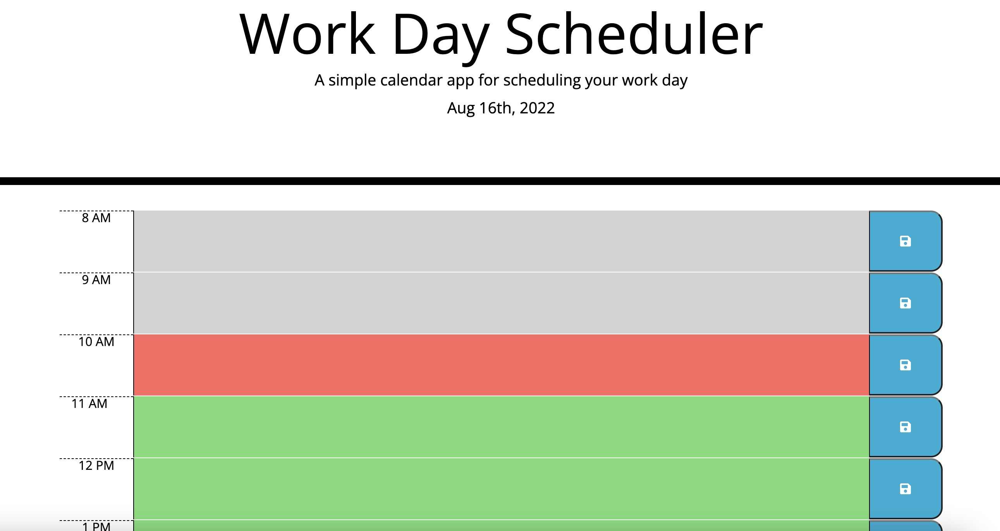

# Work Day Scheduler: work-schedule

DU Boot Camp Module 5 - Third-Party APIs Challenge: Work Day Scheduler

---

## Description

This work day scheduler is an application that designed to alllow users to input any event/activites to help keep organized with their work day. Featuring color coding of the time blocks, this application allows for a smooth UI. This project's main purpose was to advance and improve my knowlege/skill with `JavaScript`, `jQuery`, `bootstrap`, and `Moment.js`.

### Requirements

A list of requirements derrived from acceptance criteria and personal goals:

- The current date displayed on top of webpage
- Time blocks to match the approximate hours of the work day
- Color coded time blocks: past, present, future
- The ability for user to add an event
- The event text saved in local storage & saved events persist

### Skills Learned/ Improved

Here is a list of some skills I learned and/or improved throughout this project:

- Better understanding of the differenes in `jQuery `and plain `JavaScript` syntax
- Using `localStorage` to save data
- Using `Moment.js` for date and time
- `Bootstrap` for minimal styling

Tools used to complete this project:

- VS Code
- Terminal
- Chrome Dev Tools
- GitHub

## Usage

The primary use for this application is to be an organizational tool for events going on throughout the work day. This can also be used for non-work activites if preferred. However, the available time blocks are limited to the appromixate hours of a standard work day.

### Links

[Link](https://alverson98.github.io/work-schedule/) to deployed website.

[Link](https://github.com/alverson98/work-schedule) to code repository.

## Credits

I recieved guidance and tips from the instructional staff, TA's, and Students from the University of Denver Coding Boot Camp.
